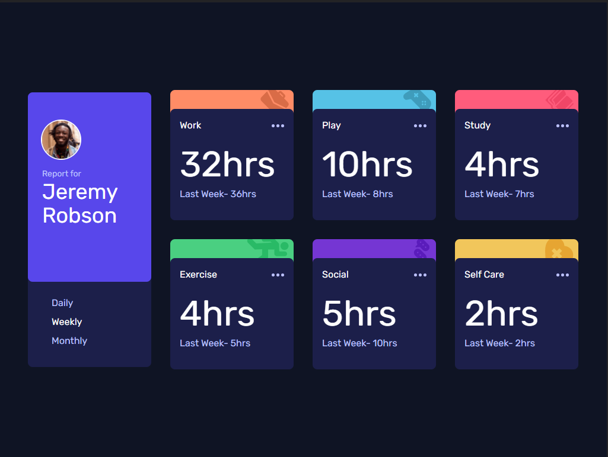

# Frontend Mentor - Time tracking dashboard solution

This is a solution to the [Time tracking dashboard challenge on Frontend Mentor](https://www.frontendmentor.io/challenges/time-tracking-dashboard-UIQ7167Jw). Frontend Mentor challenges help you improve your coding skills by building realistic projects.

## Table of contents

- [Frontend Mentor - Time tracking dashboard solution](#frontend-mentor---time-tracking-dashboard-solution)
  - [Table of contents](#table-of-contents)
  - [Overview](#overview)
    - [The challenge](#the-challenge)
    - [Screenshot](#screenshot)
    - [Links](#links)
  - [My process](#my-process)
    - [Built with](#built-with)
    - [What I learned](#what-i-learned)
  - [Author](#author)

## Overview

### The challenge

Users should be able to:

- View the optimal layout for the site depending on their device's screen size
- See hover states for all interactive elements on the page
- Switch between viewing Daily, Weekly, and Monthly stats

### Screenshot

### Links

- Solution URL: [https://github.com/fpellicero/time-tracking-dashboad](https://github.com/fpellicero/time-tracking-dashboad)
- Live Site URL: [https://quirky-keller-39ad1f.netlify.app/](https://quirky-keller-39ad1f.netlify.app/)

## My process

### Built with

- React
- TailwindCSS
- Vite

### What I learned

My main goal tackling this challenge was to try TailwindCSS and working with utility classes. In my day to day job, I usually work with either styled-components or SASS and BEM convention, and I'm not really proud of either of those... Tailwind uses a drastically different approach, which I was very skeptical of, and I thought I should try.

I also decided to try to use Vite instead of Webpack, just because it has gotten a lot of attention lately.

To my surprise, I really liked working with Tailwind and it's utility classes. Even without being familiar with all the terminology and class names, I think I solved the challenge quicker with Tailwind than I would have with regular CSS (which I'm familiar with)... and that's amazing.

## Author

- Website - [Francesc Pellicero](https://fpellicero.com)
- Frontend Mentor - [@fpellicero](https://www.frontendmentor.io/profile/fpellicero)
- Twitter - [@fpellicero](https://www.twitter.com/fpellicero)
